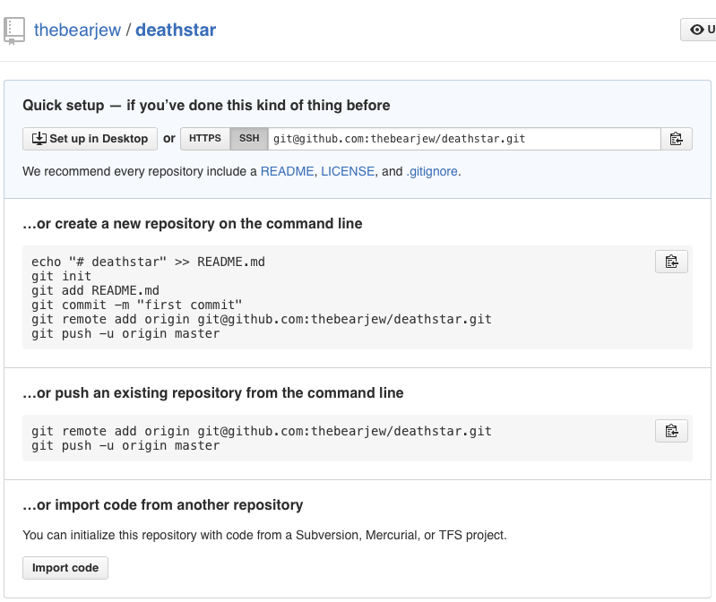

## Git Workshop

Let's learn git!

Following the main [README.md](../README.md) you should go through the installation process for your machine as well as the required `git config` commands.

**Note**: You'll see `$` these a lot. Don't actually type them in! They just mean you're entering a command!

### Configuring Git to Know "You"
Git needs to know two things about you to associate you with your commits. **Name** and **email address** - don't worry, you will never be emailed. Also, *this is not making an account*, just setting variables in a configuration file.

Do so like the:

`$ git config --global user.name "Darth Vader"`

`$ git config --global user.email "vader@deathstar.empire"`

The `--global` flag tells git that you want your **name** and **email address** to be the same across all of the repositories you work in, not just the current one.

### Creating a Repo
A **repo** is simply a directory (folder) being tracked by git. **Tracking** means that git keeps track of the changes made to files inside the folder.

So to make a repo, we first need a directory. Let's make one:

```
$ mkdir deathstar
$ cd deathstar/
```

Now we should be inside our `deathstar` directory. Let's check by using the print working directory command, `pwd`.

```
$ pwd
/home/vader/deathstar
```

Cool, but this is just a directory (or folder) without git! Let's **initialize git** in our directory:

```
$ git init
Initialized empty Git repository in /home/vader/deathstar/.git/
```

Sweet! The entire `deathstar` directory is now being tracked by git. Git uses the hidden folder **./git/** to keep track of changes &ndash; don't delete it!

We can verify that git is tracking `deathstar` by using the `git status` command: 

```
$ git status
On branch master

Initial commit

nothing to commit (create/copy files and use "git add" to track)
```

### Adding Files

As Lord Vader, we want to tell our troops what to do. Make a text file to keep all your orders in:

```
$ touch orders.txt
$ ls
orders.txt
```

Now open your text editor of choice and add the following line to `orders.txt`

```
$ vim orders.txt
$ cat orders.txt
Tear this ship apart until you find those plans
```

Now that we have `orders.txt` with content we should use our best friend **`git status`** to see what git thinks of the state of our repo right now.

```
$ git status
On branch master

Initial commit

Untracked files:
  (use "git add <file>..." to include in what will be committed)

	orders.txt

nothing added to commit but untracked files present (use "git add" to track)
```

Notice how git says **orders.txt** is untracked? That means git recognizes that this is a new text file.  To tell  git to start tracking changes to **orders.txt**, we need to add it to the staging area:

```
$ git add orders.txt
```

Right. Now git is keeping track of changes to that file. Now lets see what our status is after adding it:

```
$ git status
On branch master

Initial commit

Changes to be committed:
  (use "git rm --cached <file>..." to unstage)

	new file:   orders.txt
```

As you can see, we've added the new file **orders.txt** to git's tracking. Whenever you modify, create, or delete a file, git will tell you to add those changes.

### Committing

Now that we've made a new file, added content to it and added it to staging, time to package them into commit with a description.

```
$ git commit -m "Add initial orders"
[master (root-commit) 6323231] Initial Commit
 1 file changed, 1 insertions(+)
 create mode 100644 orders.txt
```

We've just made a commit with everything we've done until this point and given it a description "Add initial orders", which people will see when they look through the history of changes.

Next time you made changes to a file(s), go through the adding process and then this committing process. *Rinse, repeat*.

---

For this example, lets make another commit.

Open `orders.txt` and add the following line to the end:

```
Bring me YOUR_NAME - I want them alive
```

Then go through the adding the changes (above), and the commit them like we just did. 

This time write a **different commit message**. It should describe what changes you've made.

### History

So we've made a few commits. Now let's browse them to see what we changed.

Fortunately for us, there's git log. Think of Git's log as a journal that remembers all the changes we've committed so far, in the order we committed them. Try running it now:

```
$ git log
commit 3ef1ee7e39dc69a5e14119a0cca6d951b5e86c95
Author: Darth Vader <vader@deathstar.empire>
Date:   In a galaxy far, far away

    Get the passengers

commit 6323231533dcee3e9f80cc20f99dc991d4e2e34f
Author: Darth Vader <vader@deathstar.empire>
Date:   A long time ago

    Add initial order
```

### Linking to a Remote (Github)

Up until now, the work we've been doing has been on our local computer, nothing has left our little folder... time to change that.

We're going to assume you have a [Github](https://github.com/) account. Sign in now or make one.

Now, on Github **make a new repo with the same name as our directory** - "deathstar"



Thankfully, Github has been nice and explained how we can link our folder and this one (remote) together.

First we'll add the URL of this repository to our local folder, and name it `origin` with this command:

`$ git remote add origin https://github.com/YOUR_USERNAME/deathsar.git`

### Pushing
Pushing is simply update your *remote repository* with the commits you've made on a branch.

We're on the master branch with two commits (the ones we just made). And we want to send this to our repository on Github. Lets `push` the commits to the corresponding branch:

```
$ git push -u origin master
Counting objects: 3, done.
Delta compression using up to 4 threads.
Compressing objects: 100% (2/2), done.
Writing objects: 100% (3/3), 804 bytes | 0 bytes/s, done.
Total 3 (delta 0), reused 0 (delta 0)
To git@github.com:YOUR_USERNAME/deathstar.git
 * [new branch]      master -> master
Branch master set up to track remote branch master from origin.
```

This means push to the `origin` (https://github.com/YOUR_USERNAME/deathstar.git) branch called `master` (the same one we're on). If we were on another branch, we would push to the branch with the same name.

Git is also telling us that the remote now has a new branch called `master`! The same one we were working on

**Note**: The `-u` is only used the first time to connect branches between local and remote repositories. Next time you push do so like this `$ git push origin branch-name`.

Refresh the page on your Github repo!

### Working Together (Cloning, Pushing, Pulling)
In order to practice pulling, you need to work with another person. So turn to the person next to you, say hi, ask their name, and their Github username.

One person will be called "Developer A" and the other "Developer B".

Dev A should **add Dev B as a collaborator** on their Github repository (https://github.com/DEVELOPER-A/deathstar.git).

You can do that by going to Settings > Collaborators > Then add Dev B's username.

##### - Cloning Someone Else's Repository
Dev B should now `clone` Dev A's repository on Github.

```
$ cd
$ git clone https://github.com/DEVELOPER-A/deathstar.git deathstar-other
Cloning into 'deathstar-other'...
remote: Counting objects: 3, done.
remote: Compressing objects: 100% (2/2), done.
remote: Total 3 (delta 0), reused 3 (delta 0), pack-reused 0
Receiving objects: 100% (3/3), done.
Checking connectivity... done.
```
Congrats Dev B, you just clone Dev A's work! Now `cd` into the repo and open up `orders.txt`... You should see Dev A's print statement at the end:

```
Bring me DEVELOPER-A - I want them alive
```

##### - Pushing to Dev A's Repo
Okay Dev B, your time to shine!

Edit `orders.txt` and give (type up) any order you like.

- Add the changes
- Commit the changes
- Push the commits to the master branch on Dev A's repo

If you need help, there are mentors around the room ready to help you

##### - Pulling Dev B's Additions
Your turn Dev A. So your friend and made a commit to your repo, awesome! 

But how do you get those changes onto your local repository? With **pulling**. Pulling is simply the opposite of pushing (duh!) - it means there are things on the remote you don't have which you want, so you **pull them down to your computer**.

Here's a picture to visualize


Time to pull:

```
$ git pull 
remote: Counting objects: 4, done.
remote: Compressing objects: 100% (1/1), done.
remote: Total 4 (delta 2), reused 4 (delta 2), pack-reused 0
Unpacking objects: 100% (4/4), done.
From github.com:thebearjew/deathstar
   c6ff65f..9b39773  master     -> origin/master
Updating c6ff65f..9b39773
Fast-forward
 orders.txt | 2 ++
 1 file changed, 2 insertions(+)
``` 

Now, Dev A, open your `orders.txt` file and you should see the additions that Dev B made!

Pulling worked!

### Branching and Checking Out
Branching is actually the most important feature of Git. It allows 2 or 2,000 developers work on the same code without writing over or deleting each other's work.

So we just learned the ins-and-outs of pulling and pushing our changes (or commits) to a repository.

However, **what happens if Dev A decides to rename `orders.txt` to `chill.txt`**?

Dev B will still have their file named `orders.txt`. After they edit `orders.txt`, add the changes, commit them, and push them, they might get this error.

```
$ git push origin master
To git@github.com:DEVELOPER-A/deathstar.git
 ! [rejected]        master -> master (fetch first)
error: failed to push some refs to 'git@github.com:DEVELOPER-A/deathstar.git'
hint: Updates were rejected because the remote contains work that you do
hint: not have locally. This is usually caused by another repository pushing
hint: to the same ref. You may want to first integrate the remote changes
hint: (e.g., 'git pull ...') before pushing again.
hint: See the 'Note about fast-forwards' in 'git push --help' for details.
```

Dev B is unable to push because Dev A made changes and pushed them before Dev B did. 

Now Dev B should try to `$ git pull` and see what happens -> a **merge conflict**.

**A merge conflict is the same as two people trying to write on the same line of paper at the same time**. We can avoid this by giving each person a copy of the paper and let them work on their own, this is **branching**.


##### - Practice Branching
Both Dev A and Dev B should make their own branches:

```
#Dev A
$ git checkout -b feature/<DEVELOPER_A_NAME>           <-"jake" for example
Switched to a new branch 'feature/<DEVELOPER_A_NAME>'
```

```
#Dev B
$ git checkout -b feature/<DEVELOPER_B_NAME>
Switched to a new branch 'feature/<DEVELOPER_B_NAME>'
```

The command `$ git checkout -b branch-name` creates a branch and simultaneously switch to it.

`checkout` allows you to jump between branches. Do so later by using `$ git checkout branch-name`

We can see that we made the branch successfully by asking Git to list the branches

```
$ git branch -a 
*feature/<YOUR_NAME>
master
remote/origin/master
```

Dev A Add the following to `orders.txt`

```
Come to the dark side
```

Dev B add the following to `orders.txt`

```
Overthrow the emperor
```

Both Devs add, commit, and push like so `$ git push origin feature/<YOUR_NAME>`

Now check the Github repo and you should see `3 branches` at the top.